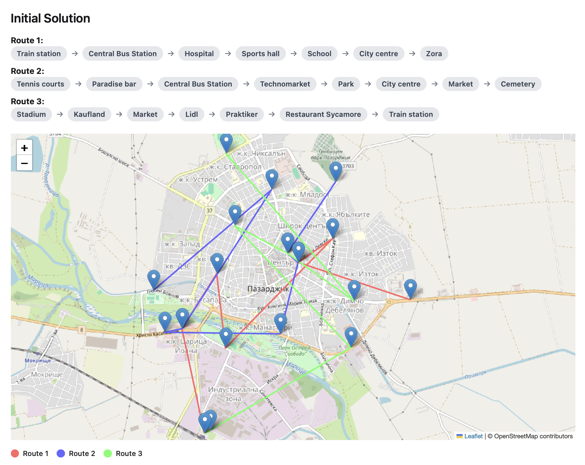
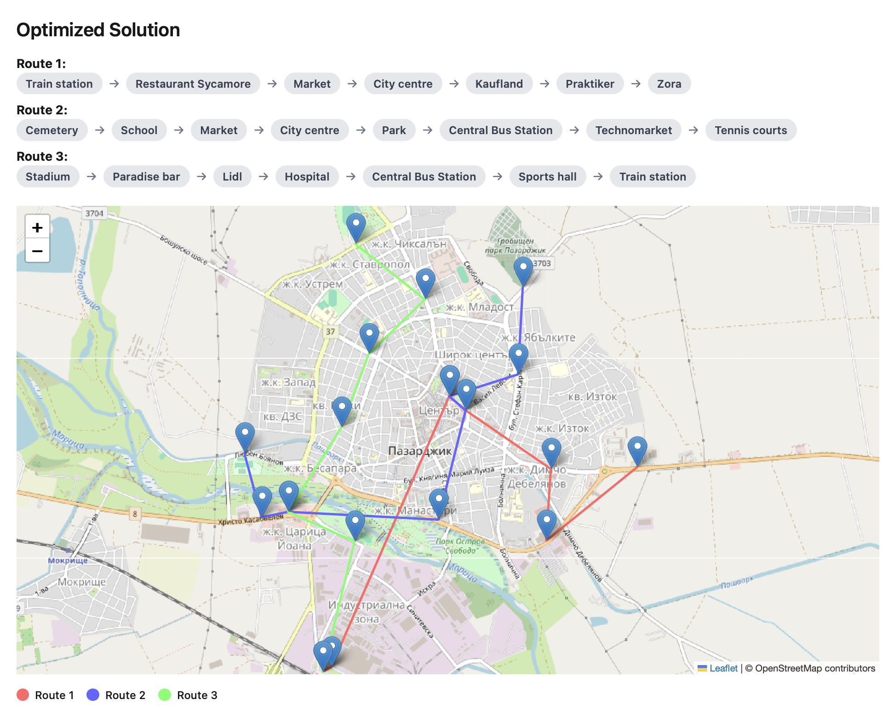

# PublicTransportOptimization
***Algorithmic Optimization of Urban Public Transport***

This project is a software prototype developed as part of a **Bachelor’s thesis** at **Plovdiv University “Paisii Hilendarski”, Faculty of Mathematics and Informatics**.

It demonstrates how modern optimization algorithms can be applied to improve the **efficiency, sustainability and quality of urban public transport systems**.

# Project Overview
Urban transport networks often suffer from inefficient routing, inconvenient schedules and poor connectivity, which leads to low passenger satisfaction and increased use of private vehicles.

This project explores how **algorithmic optimization techniques** can be used to:
- Optimize transport routes between existing stops
- Reduce travel distance and time
- Improve overall route efficiency
- Provide a foundation for intelligent transport planning systems
  
A working software prototype is implemented, allowing different optimization algorithms to be applied and compared on simulated transport networks.

# Key Features
- Optimization of transport routes between predefined stops
- Comparison of multiple optimization algorithms
- Visualization of optimized routes and results
- Modular and extensible architecture designed for future expansion

# Implemented Algorithms
The system currently supports and evaluates:
- **Simulated Annealing (SA)**
- **Ant Colony Optimization (ACO)**

These algorithms are applied to transport routing problems in a form similar to the **Traveling Salesman Problem (TSP)**, adapted to urban transport networks.

# Results - Simulated Annealing (Before & After)
The following example demonstrates how **Simulated Annealing (SA)** improves route efficiency by reorganizing the transport network to reduce unnecessary crossings and travel distance.

**Initial Solution (Before Optimization):**

  

*Baseline routing generated from an initial solution. Routes contain multiple long crossings and inefficient path ordering.*

**Optimized Solution:**

  

*Optimized routing produced by the Simulated Annealing algorithm. Routes are reorganized to minimize distance and improve network coherence.*
